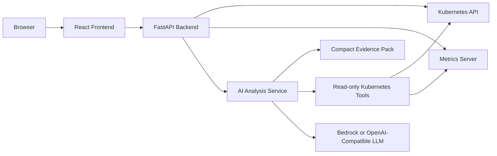

# KubeOps Insight

KubeOps Insight is a lightweight Helm-installed Kubernetes dashboard for live cluster visibility, deterministic diagnostics and bounded AI-assisted investigation.

It reads the Kubernetes API directly, keeps mutating actions disabled, and requires a real LLM provider for AI analysis. Amazon Bedrock is the default provider; OpenAI-compatible Chat Completions APIs are also supported.

## Architecture



The backend collects live Kubernetes resources, deterministic findings, recent events and optional Metrics Server data. AI requests use compact evidence packs and bounded read-only investigations instead of sending unrestricted cluster state.

## Features

- Helm-installed dashboard for existing Kubernetes clusters.
- FastAPI backend with health, readiness, Kubernetes, metrics, findings, auth and AI endpoints.
- React and TypeScript frontend for cluster overview, namespace/resource views, findings and chat.
- Live Kubernetes summary from namespaces, nodes, pods, deployments and events.
- Resource coverage for Pods, Deployments, Services, StatefulSets, DaemonSets, Jobs, PVCs, Ingresses and workload summaries.
- Deterministic findings for pod failures, deployments, nodes, warning events, PVCs, probes, image tags and resource requests/limits.
- Optional Metrics Server Helm dependency, disabled by default to avoid conflicts with clusters that already provide it.
- Metrics summary reports `unavailable` safely when Metrics Server is absent, starting, broken or not currently serving metrics.
- `POST /api/v1/ai/analyze` returns structured cluster diagnostics from live evidence.
- `POST /api/v1/chat` answers Spanish natural-language questions with bounded read-only evidence.
- Bedrock chat uses a Strands diagnostic agent with tool, cycle, timeout, token, log and cost limits.
- OpenAI-compatible chat uses compact evidence packs to keep prompts small and provider-agnostic.
- Chat responses expose tools used, cache status and evidence packs; Bedrock agent responses also expose agent metrics.
- In-memory TTL caching for Kubernetes and AI responses.
- Local username/password authentication with HTTP-only session cookies.
- Optional OIDC login configuration.
- Dockerfiles, Docker Compose workflow and Helm chart with Deployments, Services, RBAC, NetworkPolicy and PDB.

## Requirements

- Python 3.12+
- Node.js 22+
- Docker
- Helm 3
- Access to an existing Kubernetes cluster
- A configured LLM provider: Amazon Bedrock or an OpenAI-compatible endpoint

## Quick Start

```bash
make setup
make dev
```

For local backend auth, create `backend/.env` from the example and set real values:

```bash
cp backend/.env.example backend/.env
```

Backend:

```bash
curl http://localhost:8000/health
curl http://localhost:8000/api/v1/ready
```

API docs:

```text
http://localhost:8000/docs
http://localhost:8000/redoc
http://localhost:8000/openapi.json
```

If authentication is enabled, protected endpoints in Swagger UI require logging in first so the browser holds a valid session cookie.

Frontend:

```text
http://localhost:5173
```

Local login:

- Username: `admin`
- Password: the value configured in `backend/.env`

## Helm Install

Add the public Helm repository:

```bash
helm repo add kubeops-insight https://yosoyfunes.github.io/kubeops-insight
helm repo update
```

Install with default Bedrock provider values:

```bash
helm upgrade --install kubeops-insight kubeops-insight/kubeops-insight \
  --namespace kubeops-insight \
  --create-namespace
```

The chart installs the frontend on service port `80` and backend on service port `8000`.

```bash
kubectl -n kubeops-insight port-forward svc/kubeops-insight-kubeops-insight-frontend 5173:80
```

Open `http://localhost:5173`.

Authentication is always required. If `auth.password` is empty, the chart generates and preserves an initial password in the chart-managed Secret.

```bash
kubectl -n kubeops-insight get secret kubeops-insight-kubeops-insight-auth \
  -o jsonpath='{.data.password}' | base64 --decode
```

Default username: `admin`.

## LLM Providers

### Amazon Bedrock

Bedrock is the default provider. On EKS, use IRSA so the AWS SDK obtains temporary credentials from the annotated ServiceAccount. Static AWS access keys are not supported by the chart.

```bash
helm upgrade --install kubeops-insight kubeops-insight/kubeops-insight \
  --namespace kubeops-insight \
  --create-namespace \
  --set llm.provider=bedrock \
  --set llm.bedrock.region=us-east-1 \
  --set llm.bedrock.modelId=us.anthropic.claude-haiku-4-5-20251001-v1:0 \
  --set serviceAccount.annotations.eks\.amazonaws\.com/role-arn=arn:aws:iam::123456789012:role/KubeOpsInsightBedrockIrsaRole
```

For local backend development, use an AWS SSO-backed profile through the normal AWS SDK credential chain:

```bash
AWS_PROFILE=claude KOI_AWS_PROFILE=claude KOI_LLM_PROVIDER=bedrock \
  .venv/bin/uvicorn app.main:app --host 127.0.0.1 --port 8000
```

### OpenAI-Compatible APIs

Create a Kubernetes Secret with key `apiKey`:

```bash
kubectl -n kubeops-insight create secret generic kubeops-insight-openai \
  --from-literal=apiKey='replace-me'
```

Install with any OpenAI-compatible Chat Completions endpoint:

```bash
helm upgrade --install kubeops-insight kubeops-insight/kubeops-insight \
  --namespace kubeops-insight \
  --create-namespace \
  --set llm.provider=openai-compatible \
  --set llm.openaiCompatible.baseUrl=https://api.openai.com/v1 \
  --set llm.openaiCompatible.model=gpt-4o-mini \
  --set llm.openaiCompatible.existingSecret=kubeops-insight-openai
```

Gemini can be used through Google's OpenAI-compatible endpoint. `gemini-flash-lite-latest` is currently the recommended model because `gemini-flash-latest` may return transient high-demand `503` errors.

```bash
kubectl -n kubeops-insight create secret generic kubeops-insight-gemini \
  --from-literal=apiKey='replace-me'

helm upgrade --install kubeops-insight kubeops-insight/kubeops-insight \
  --namespace kubeops-insight \
  --create-namespace \
  --set llm.provider=openai-compatible \
  --set llm.openaiCompatible.baseUrl=https://generativelanguage.googleapis.com/v1beta/openai \
  --set llm.openaiCompatible.model=gemini-flash-lite-latest \
  --set llm.openaiCompatible.existingSecret=kubeops-insight-gemini
```

## Metrics Server

KubeOps Insight can use an existing Metrics Server. It can also install Metrics Server as an optional Helm dependency.

```bash
helm upgrade --install kubeops-insight kubeops-insight/kubeops-insight \
  --namespace kubeops-insight \
  --create-namespace \
  --set metrics.metricsServer.install=true
```

For local or lab clusters that require insecure kubelet TLS, pass Metrics Server dependency args explicitly:

```bash
helm upgrade --install kubeops-insight kubeops-insight/kubeops-insight \
  --namespace kubeops-insight \
  --create-namespace \
  --set metrics.metricsServer.install=true \
  --set 'metrics-server.args[0]=--kubelet-insecure-tls'
```

If Metrics Server is absent, starting, unavailable or unable to serve metrics, the backend returns `status=unavailable` instead of failing the dashboard.

## Development Commands

```bash
make setup
make dev
make test
make lint
cd frontend && npm run build
make helm-lint
make helm-template
```

## Security Defaults

- Kubernetes access is read-only by default.
- Actions are disabled by default.
- Arbitrary shell and unrestricted `kubectl` execution are not allowed.
- LLM providers receive compact evidence, not unrestricted cluster access.
- Secrets must be stored in Kubernetes Secrets, not ConfigMaps.
- Bedrock on EKS should use IRSA and the AWS SDK credential chain.
- Containers run as non-root with read-only root filesystem defaults.

## Current Limitations

- Kubernetes reads use a simple in-memory TTL cache, not watches/informers.
- Prometheus integration is still pending.
- Fine-grained RBAC based on OIDC groups is still pending.
- Mutating action execution is not implemented.

## Contributing

See `CONTRIBUTING.md`.
