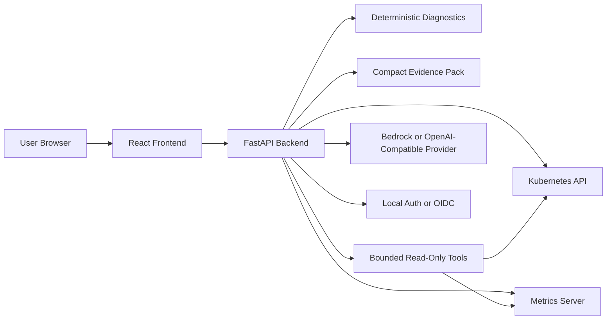

# System Architecture

KubeOps Insight is structured as a Helm-installed frontend and backend pair.

## Architecture

## Runtime responsibilities

### Frontend

- authenticated dashboard UI
- namespace and severity filtering
- overview, workloads, diagnostics, events, and AI surfaces
- requests against `/api/v1`

### Backend

- health and readiness endpoints
- auth and OIDC flow
- live Kubernetes reads
- deterministic findings generation
- metrics summary reads
- AI analyze and chat orchestration

### Kubernetes integration

The product uses direct live Kubernetes API reads plus in-memory TTL caching. It does not rely on watches, informers, or a persistent cluster state store.

### AI integration

The AI path is grounded by:

- compact evidence packs
- deterministic findings
- bounded read-only tools
- provider-specific limits

## Design constraints

- no arbitrary shell execution
- no mutating Kubernetes actions
- no unrestricted cluster state dump into prompts
- degrade gracefully when optional dependencies are unavailable

## Operational model

- live Kubernetes reads are cached in memory with a TTL-based approach
- authentication protects product access
- deterministic diagnostics run before AI interpretation
- AI remains bounded by compact evidence and curated read-only tools
